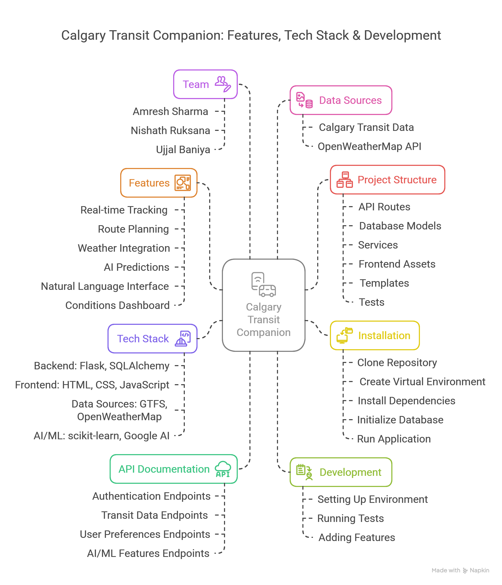

# Calgary Transit Companion

A comprehensive web application for tracking Calgary transit with real-time information, personalized route planning, and AI-powered transit insights.

## Project Visual Walkthrough


## Features

- **Real-time transit tracking** with vehicle positions on interactive map
- **Personalized route planning** with favorites and user preferences
- **Weather-aware transit information** for better trip planning
- **AI-powered predictions** for transit conditions forcast
- **Natural language interface** for intuitive transit guides
- **Transit conditions dashboard** showing system-wide status

## Tech Stack

- **Backend**: Flask, SQLAlchemy, JWT Authentication
- **Frontend**: HTML, CSS, JavaScript, Leaflet.js for maps
- **Data Sources**: Calgary Transit GTFS/GTFS-RT, OpenWeatherMap API
- **AI/ML**: scikit-learn, Google Generative AI

## Installation

1. Clone the repository:
```
git clone https://github.com/your-username/calgary-transit-companion.git
cd calgary-transit-companion
```

2. Create a virtual environment:
```
python -m venv venv
```

3. Activate the virtual environment:
   - Windows: `venv\Scripts\activate`
   - macOS/Linux: `source venv/bin/activate`

4. Install dependencies:
```
pip install -r requirements.txt
```

5. Create a `.env` file with the following variables:
```
FLASK_APP=run.py
FLASK_ENV=development
SECRET_KEY=your_secret_key
DATABASE_URI=sqlite:///transit_app.db
WEATHER_API_KEY=your_openweathermap_api_key
GOOGLE_API_KEY=your_google_api_key
```

6. Initialize the database:
```
flask db init
flask db migrate
flask db upgrade
```

7. Run the application:
```
flask run
```

## API Documentation

The API is documented using Swagger/OpenAPI specification. After running the application, visit `/api/docs` for interactive API documentation.

### Main Endpoints

- **Authentication**: `/api/auth/register`, `/api/auth/login`, `/api/auth/profile`
- **Transit Data**: `/api/routes`, `/api/stops/<stop_id>`, `/api/vehicles`, `/api/trips/<trip_id>`
- **User Preferences**: `/api/favorites`
- **AI/ML Features**: `/api/query`, `/api/predictions/<stop_id>`

## Project Structure

```
calgary-transit-companion/
├── api/                    # API routes and controllers
│   ├── auth.py             # Authentication endpoints
│   ├── routes.py           # Transit data endpoints
│   └── ...
├── database/               # Database models and config
│   ├── models.py           # SQLAlchemy models
│   └── ...
├── services/               # Business logic services
│   ├── gtfs_service.py     # GTFS data processing
│   ├── realtime_service.py # Real-time data handling
│   ├── weather_service.py  # Weather integration
│   ├── ml_service.py       # Basic ML predictions
│   └── enhanced_ml_service.py # Advanced ML features
├── static/                 # Frontend assets
│   ├── css/                # Stylesheets
│   ├── js/                 # JavaScript files
│   └── ...
├── templates/              # HTML templates
├── tests/                  # Unit and integration tests
├── .env.example            # Example environment variables
├── app.py                  # Application initialization
├── main.py                 # Alternative entry point
├── requirements.txt        # Project dependencies
├── run.py                  # Development server entry point
└── README.md               # Project documentation
```

## Development

### Setting Up Development Environment

Follow the installation steps above. For development, it's recommended to use:
```
flask run --debug
```

### Running Tests

```
pytest
```

### Adding New Features

1. Create a new branch for your feature:
```
git checkout -b feature/your-feature-name
```

2. Implement your changes
3. Write tests for your features
4. Submit a pull request

## Data Sources

- [Calgary Transit GTFS Data](https://data.calgary.ca/Transportation-Transit/Calgary-Transit-GTFS-Data/npk7-z3bj)
- [Calgary Transit Realtime Vehicle Positions](https://data.calgary.ca/Transportation-Transit/Calgary-Transit-Realtime-Vehicle-Positions-GTFS-RT/am7c-qe3u)
- [Realtime Calgary Transit Trip Updates](https://data.calgary.ca/Transportation-Transit/Realtime-Calgary-Transit-Trip-Updates-GTFS-RT/gs4m-mdc2)
- [Realtime Calgary Transit Alerts](https://data.calgary.ca/Transportation-Transit/Realtime-Calgary-Transit-Alerts-GTFS-RT/jhgn-ynqj)
- [OpenWeatherMap API](https://openweathermap.org/api)


## Team

- [@AmreshSharma01](https://github.com/AmreshSharma01) - Amresh Sharma (API , Authentication and Backend)
- [@NishathRuksana](https://github.com/NishathRuksana) - Nishath Ruksana (Frontend & Advanced Features)
- [@Ujjal-Baniya](https://github.com/Ujjal-Baniya) - Ujjal Baniya (Backend and Data Management)

